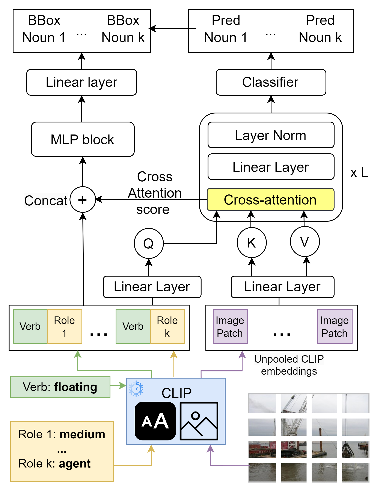
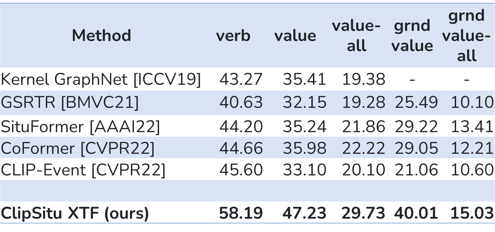

# ClipSitu: Effectively Leveraging CLIP for Conditional Predictions in Situation Recognition
[](https://paperswithcode.com/sota/situation-recognition-on-imsitu?p=clipsitu-effectively-leveraging-clip-for)
[](https://paperswithcode.com/sota/grounded-situation-recognition-on-swig?p=clipsitu-effectively-leveraging-clip-for)


This repository contains the official PyTorch implementation of the paper:

**ClipSitu: Effectively Leveraging CLIP for Conditional Predictions in Situation Recognition**  
Debaditya Roy, Dhruv Verma, and Basura Fernando  
WACV 2024
<!---
[Link to the paper](https://openaccess.thecvf.com/content/WACV2024/papers/Roy_ClipSitu_Effectively_Leveraging_CLIP_for_Conditional_Predictions_in_Situation_Recognition_WACV_2024_paper.pdf)
--->
[](https://arxiv.org/abs/2307.00586)


## Abstract
Situation Recognition is the task of generating a structured summary of what is happening in an image using an activity verb and the semantic roles played by actors and objects. In this task, the same activity verb can describe a diverse set of situations as well as the same actor or object category can play a diverse set of semantic roles depending on the situation depicted in the image. Hence a situation recognition model needs to understand the context of the image and the visual-linguistic meaning of semantic roles. Therefore, we leverage the CLIP foundational model that has learned the context of images via language descriptions. We show that deeper-and-wider multi-layer perceptron (MLP) blocks obtain noteworthy results for the situation recognition task by using CLIP image and text embedding features and it even outperforms the state-of-the-art CoFormer, a Transformer-based model, thanks to the external implicit visual-linguistic knowledge encapsulated by CLIP and the expressive power of modern MLP block designs. Motivated by this, we design a cross-attention-based Transformer using CLIP visual tokens that model the relation between textual roles and visual entities. Our cross-attention-based Transformer known as ClipSitu XTF outperforms existing state-of-the-art by a large margin of 14.1% on semantic role labelling (value) for top-1 accuracy using imSitu dataset. Similarly, our ClipSitu XTF obtains state-of-the-art situation localization performance. We will make the code publicly available.

## Contents
1. [Introduction](#introduction)
2. [Datasets](#datasets)
3. [Requirements](#requirements)
4. [Usage](#usage)
5. [Results](#results)
6. [Citation](#citation)
7. [Acknowledgements](#acknowledgements)

## Introduction
ClipSitu focuses on Situation Recognition, leveraging the power of the CLIP foundational model to understand the context of images via language descriptions. This repository provides the official implementation of the models and its associated techniques.

## XTF Block Diagram


## Datasets
### imSitu
imSitu is a dataset supporting situation recognition, the problem of producing a concise summary of the situation an image depicts including: (1) the main activity, (2) the participating actors, objects, substances, and locations and most importantly (3) the roles these participants play in the activity. The role set used by imSitu is derived from the linguistic resource FrameNet and the entities are derived from ImageNet. The data in imSitu can be used to create robust algorithms for situation recognition.

### SWiG Dataset
The SWiG dataset essentially adds groundings to imSitu. Annotations are provided in JSON format, and the annotation files are located under the "SWiG/SWiG_jsons/" directory. Images for the SWiG dataset can be downloaded [here](https://swig-data-weights.s3.us-east-2.amazonaws.com/images_512.zip). Once downloaded, the images should be stored in the "SWiG/images_512/" directory.

In the SWiG dataset, each image is associated with a Verb, Frame, and Groundings. Detailed annotation examples and additional information for verbs and nouns are provided in the dataset documentation.

### CLIP Embeddings
CLIP Embeddings can be generated by following this notebook (notebooks/CLIP_embeddings.ipynb). Alternatively, we provide CLIP embeds for vit-b32 encoder, for image, verb, role and noun. They can be downloaded from google drive [here](https://drive.google.com/drive/folders/1xkz2M8NwwUAObEpC2xISS2Cl5hruEgl7?usp=drive_link). Add them as needed to the "data/processed/" directory in this repo.

## Models
CLIP ViT-B/32 based verb and BB models (bounding box) are also provided in the google drive [here](https://drive.google.com/drive/folders/1UlxH9qPjmS4mf7w17TRbw6vZx8BDevU7) for use.

## Requirements
- Python 3.6 or higher
- PyTorch 1.8 or higher
- Transformers library
- NumPy
- Pandas
- tqdm

## Usage
### Installation
- Clone this repo:
```bash
git clone https://github.com/LUNAProject22/CLIPSitu
cd ClipSitu
pip install -r requirements.txt
```
### Training
```bash
python main.py --gpuid 1 --model [MODEL_TYPE] --epochs [NUMBER_OF_EPOCHS] --batch_size [BATCH_SIZE]
```
[MODEL_TYPE] can be mlp, transformer, xtf

### Testing
To evaluate on the dev set with the saved model, run
```bash
python main.py --gpuid 1 --model [MODEL_TYPE] --load_model [trained_model_name] --evaluate
```
To evaluate on the test set with the saved model, run
```bash
python main.py --gpuid 1 --model [MODEL_TYPE] --load_model [trained_model_name] --test
```


## Results

### SOTA TABLE


## Citation
If you use this code for your research, please cite our paper:
```bibtext
@InProceedings{Roy_2024_WACV,
    author    = {Roy, Debaditya and Verma, Dhruv and Fernando, Basura},
    title     = {ClipSitu: Effectively Leveraging CLIP for Conditional Predictions in Situation Recognition},
    booktitle = {Proceedings of the IEEE/CVF Winter Conference on Applications of Computer Vision (WACV)},
    month     = {January},
    year      = {2024},
    pages     = {444-453}
}

```


## Acknowledgments
Our code is inspired by [CoFormer](https://github.com/jhcho99/CoFormer).

This research/project is supported by the National Research Foundation, Singapore, under its NRF Fellowship (Award# NRF-NRFF14-2022-0001). This research is also supported by funding allocation to B.F. by the Agency for Science, Technology and Research (A*STAR) under its SERC Central Research Fund (CRF), as well as its Centre for Frontier AI Research (CFAR).

